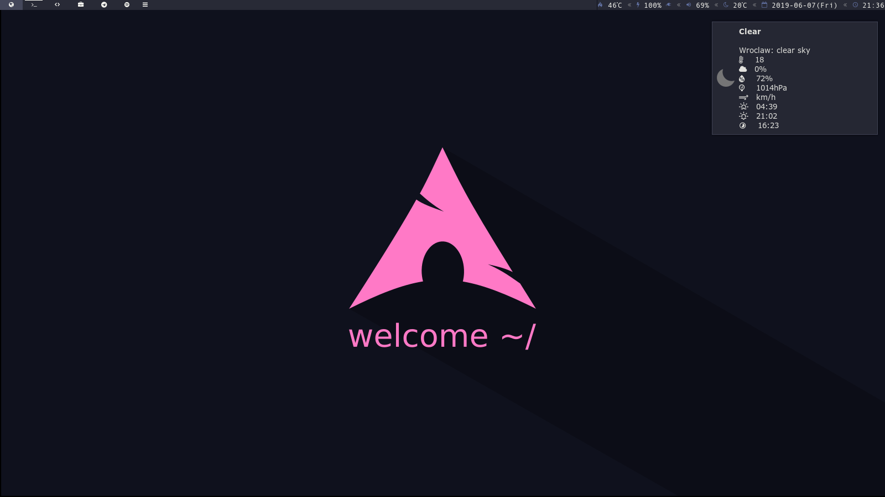
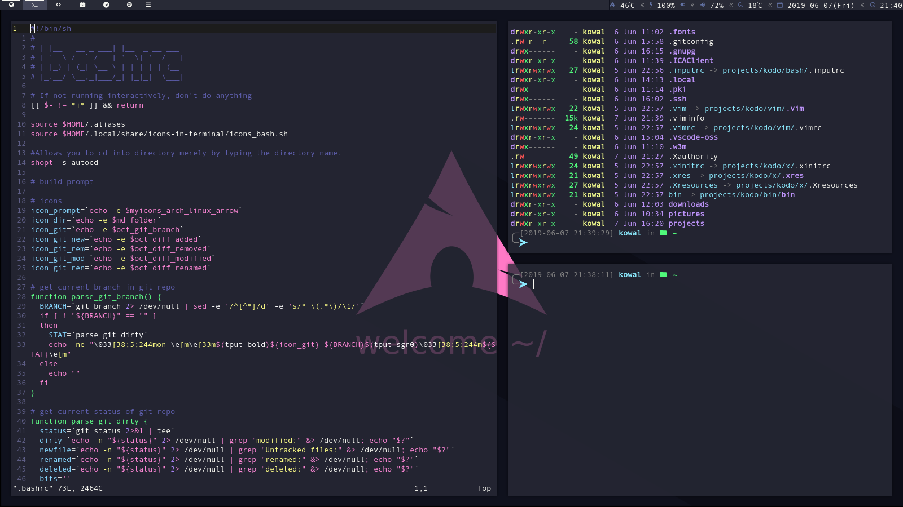
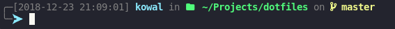
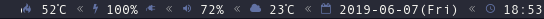

# KODO

KOwal's DOtfiles




## Purpose

This repo contains my dotfiles and scripts that can easily set up a new mashine. Also this is backup of my desktop settings in case of any errors on my computer.

## Setup

Clone repo.

`$KODO` dir is folder where KODO repo is cloned to (e.g. `$HOME/projects/kodo`)

Be sure to install `stow` (all install commands are prepared for Arch Linux).

```sh
sudo pacman -S stow
```

More information about program can be found [here](https://www.gnu.org/software/stow/). Also see [this article](http://brandon.invergo.net/news/2012-05-26-using-gnu-stow-to-manage-your-dotfiles.html) to understand how to use `stow` to manage dotfiles.

Be sure to remove files to be stowed from `$HOME` dir before use `stow` (e.g. delete/backup `.bash*`, `.xinitrc` files). Then execute commands from `$KODO` directory.

```sh
stow --target=$HOME bash
stow --target=$HOME bin
stow --target=$HOME dunst
stow --target=$HOME hour-bg
stow --target=$HOME vim
stow --target=$HOME x
```

Also it is worth to install these apps:

```sh
sudo pacman -S --needed --noconfirm curl gvim rofi feh pulseaudio playerctl compton acpi scrot numlockx exa sysstat dunst youtube-dl nodejs xclip make makepkg xss-lock libnotify pacman-contrib alsa-utils wget telegram-desktop
```

This project should be used alongside with my [fork of dwm](https://github.com/Kyczan/dwm) and [fork of st terminal](https://github.com/Kyczan/st)

Next create dirs for scrots and wallpaper:

```sh
mkdir -p $HOME/pictures/screenshots
cp $KODO/scrots/wallpapers/wallpaper.png $HOME/pictures/
```

Be sure to install AUR helper (e.g. `yay`)

```sh
cd $HOME
git clone https://aur.archlinux.org/yay.git
cd yay
makepkg -si
cd ..
rm -rf yay
```

Then install from AUR:

```sh
yay -S i3lock-color-git system-san-francisco-font-git ttf-ms-fonts vscodium-bin google-chrome vivaldi vivaldi-ffmpeg-codecs spotify
```

And install manually:

- [icons-in-terminal](https://github.com/sebastiencs/icons-in-terminal) - for nice icons
- [teiler](https://carnager.github.io/teiler/) - for making screenshots

## Content

### bash

- `.aliases` - contains useful shortcuts.
- `.bash_profile` - runs once on logon.
- `.bashrc` - runs every time when bash starts (new terminal window is spawn). Loads aliases and creates custom prompt line:



- `.inputrc` - this file defines how bash should work. Instead of using Emacs shortcuts it uses vim keys to navigate through bash prompt. Default there is enabled `insert` mode. To switch to `command` mode use `Esc` key. To distinguish modes there are two types of cursor. For `insert` mode bar/pipe `|` and for `command` mode block `█`. For reference see this [article](http://vim.wikia.com/wiki/Use_vi_shortcuts_in_terminal).

### bin

Contains bunch of scripts available across the terminal. Worth to be mentioned:

- `set-dwm-status-bar` - it is initialized in `.xinitrc` when system starts, and in the loop it prints dwm status bar.



### dunst

Contains config files for notification app

### hour-bg

Config and themes for [hour-bg](https://github.com/Kyczan/hour-bg) (app for change wallpapers dependent on the time of the day)

### vim

Config file for Vim.

### x

- `.xintrc` - runs when X session starts. Loads theme from `.Xresources` and opens `dwm`.
- `.Xresources` - defines theme for system. Loads params from `.xres` folder.
